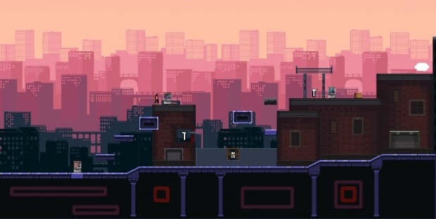
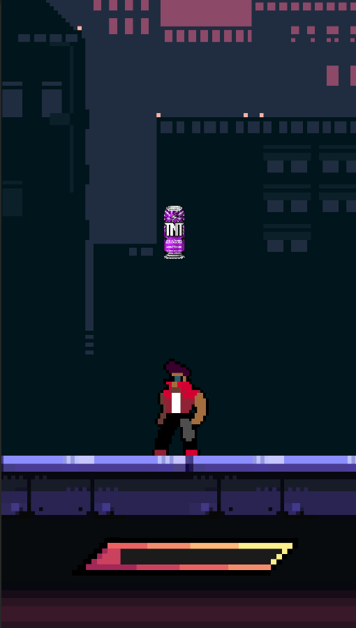
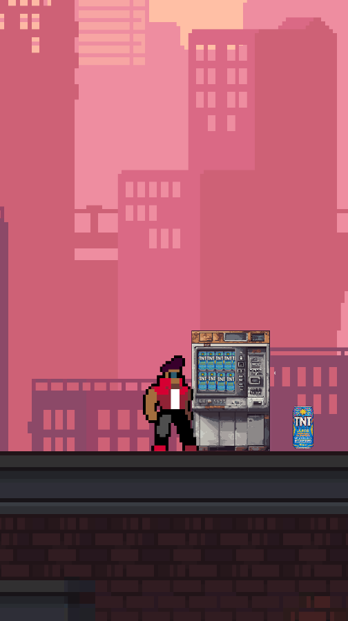

# 🎮 TNT: Grand End

 TNT: Grand End é um jogo futurista 2D desenvolvido na Unity com C#. Ambientado no ano de 2087, o jogador explora uma cidade onde a principal fonte de energia é o energético TNT. Ao coletá-lo, o personagem ativa minigames desafiadores que o ajudam a progredir até o grande evento final: o **Grand End**.

## 📜 Sobre o Projeto
O projeto foi desenvolvido pelos alunos do curso de Desenvolvimento de Games da SoulCode em parceria com o Grupo Petrópolis - TNT Energy Drink.  

## 🛠️ Tecnologias Utilizadas

- **Unity**
- **C#**
- Miro
- Ferramentas externas para arte 2D (ex: Photoshop)

---

## 🚀 Como Rodar

1. Clone o repositório:
   ```bash
   git clone https://github.com/seu-usuario/game-tnt-grand-end.git

---

## 📷 Prévia

<p align="center">
 
   
 ---
  
 ---
  
 ---
</p>

---

##👤 Autores

[Caren Teva](https://www.linkedin.com/in/caren-t-neves/])    

[Douglas Coelho](https://www.linkedin.com/in/douglasoliveiracoelho/])

[Gabriel Kazmierczak](www.linkedin.com/in/gabriel-kazmierczak-berça-282004272])

[Heber Davi Oliveira de Souza](https://www.linkedin.com/in/heber-souza-155b5537br/])

[Julia Botelho](https://www.linkedin.com/in/julia-botelho-84bb87158/])

[Lucas Mendes](https://www.linkedin.com/in/lucas-mendes-69a22434b/])

[Patrícia Ester Ferreira Rodrigues]([www.linkedin.com/in/patriciaferreirash])


